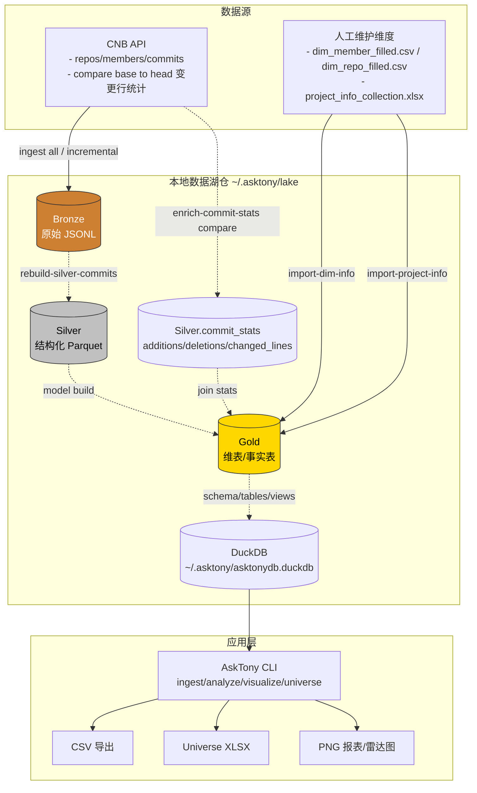

# AskTony 快速入门（Quickstart）

欢迎使用 **AskTony**：CNB 数据采集 + 本地数仓（DuckDB/DuckLake 分层）+ 分析/可视化报告的一站式 CLI 工具。

## 1) 核心概念：分层数仓（Bronze/Silver/Gold）

AskTony 数据分析模型：

- **Bronze（青铜层）**：接口原样落地（`jsonl`），便于追溯与重放。
- **Silver（白银层）**：结构化明细（`parquet`），清洗/去重/标准化。
- **Gold（黄金层）**：维度/事实模型（DuckDB 表/视图 + `parquet`），面向分析与报表。



## 2) 环境准备与安装

要求：
- Python **3.13**
- macOS/Linux/Windows（WSL）均可

建议用虚拟环境安装：

```bash
python -m venv .venv
source .venv/bin/activate
pip install -U pip
pip install -e .

asktony --help
```

## 3) 初始化配置（CNB 凭证）

配置会写入 `~/.asktony/config.toml`。

`--group` 填 **组织的 slug/path**（通常就是组织 URL 里的那段路径，例如组织主页是 `https://cnb.cool/clife`，则填 `clife`）。

```bash
asktony config set --username <cnb_user> --token <cnb_token> --group <group_slug_or_path>
```

如果你的 token 鉴权不是 Bearer：

```bash
asktony config set --username <cnb_user> --token <cnb_token> --group <group> --auth-header Private-Token --auth-prefix ""
```

## 4) 数据采集（CNB -> Bronze）

首次建议全量拉一次：

```bash
asktony ingest all --months 6
```

日常/不定时增量（可隔 1 天、隔 3 天随时跑）：按仓库 watermark + overlap 回看去重。

```bash
# --overlap-days 1：回看 1 天避免边界遗漏
# --bootstrap-months 2：新仓库默认回溯 2 个月
asktony ingest incremental --overlap-days 1 --bootstrap-months 2
```

回填每个 commit 的增删行（`additions/deletions/changed_lines`）：

> CNB 的 commits 列表接口不返回 stats，因此 AskTony 默认采集到的这 3 个字段可能全是 0。
> 你可以用 compare(base...head) 接口对最近窗口做一次增量回填。

```bash
# 默认回填最近 2 个月，最多 5000 条（避免误操作）
asktony ingest enrich-commit-stats --months 2
```

## 5) 数据处理（Bronze -> Silver）与建模（Silver -> Gold）

仅用 Bronze 的已落地数据重建 `silver/commits.parquet`（不会再调用 CNB API）：

```bash
asktony ingest rebuild-silver-commits
```

构建模型（维表/事实表）：

```bash
# 注意：建模前请关闭占用 DuckDB 的客户端（如 DBeaver），否则会出现文件锁冲突。
asktony model build
```

## 6) 维度标准化（补充成员/仓库：姓名、部门、角色）

导出模板：

```bash
asktony export-member-template --output dim_member_template.csv
asktony export-repo-template --output dim_repo_template.csv
```

在线下（Excel/WPS/Sheets）补录常用字段：
- 成员：`full_name`、`department_level2_name`、`department_level3_name`、`role`
- 仓库：`department_level2_name`、`department_level3_name`

说明（避免填写困惑）：
- `member_key` 是系统生成的成员主键：在公司邮箱策略 `*@clife.cn` 生效后（正式员工形如 `aa.bb@clife.cn`，外包员工形如 `801495@clife.cn`），系统会优先用邮箱 local-part 作为 `member_key/username`：正式员工为 `aa.bb`，外包员工为 `partner-801495`；无法归并到公司员工时（外部提交）则使用该次提交携带的 `author_email` 作为 `member_key`（若 email 为空再兜底旧规则）。采集表里**不需要填写** `member_key`（模板已不再导出该列）。
- `one_id` 是 one-id 方案下的统一身份键：对“员工口径”分析，系统会优先使用 `employee_id` 作为 one-id（即每个员工的唯一 person_id），从而把同一员工可能出现的多个 `member_key/username/email/user_id` 归并到同一 `employee_id`。
- `dim_member_filled.csv` 建议以 HR 口径填写：`employee_id`（必填）+ `full_name/部门/role` + `email`；系统会自动匹配/生成内部 `member_key` 并建立“提交身份 → employee_id”的映射。
- 如果同一员工历史上出现过多个邮箱（换邮箱、历史提交用私人邮箱等），可在 `dim_member_filled.csv` 里填写 `email_aliases`（用 `;` 或 `,` 或 `|` 分隔多个值）。系统会把这些 alias 映射到该行的 `employee_id`，用于把 commits 统一归并到同一员工。
- Commit 归并口径：在 CNB 强制提交必须带 `author_email` 后，系统默认以 `author_email` 作为 commit 侧归并主键（`gold.fact_commit_employee` 仅使用 email 进行员工映射）。
- 若 `username/email` 匹配到多个成员（或 email/username 指向不同 member_key），导入会报错提示需要人工确认。

导入前先做数据质量校验（不写入）：

```bash
asktony import-dim-info --member-file tos/dim_member_filled.csv --repo-file tos/dim_repo_filled.csv --dry-run
```

通过后再写入：

```bash
asktony import-dim-info --member-file dim_member_filled.csv --repo-file dim_repo_filled.csv
```

## 7) 常用分析与导出

--top 300：表示只取前 300 条记录，默认 top
--all：表示取所有，建议导出 csv 时，要加上 --all

员工个人及直线上级评分/反刷分规则详细介绍 - [打分/反刷规则文档](docs/scoring.md) 

```bash
asktony analyze active-repos --months 3 [--top 200/--all]
asktony analyze member-commits --months 3 [--top 200/--all]
asktony analyze active-members --months 2 [--top 2000/--all] [--all-fields]
asktony analyze inactive-members --months 2 [--top 2000/--all] [--all-fields]
asktony analyze external-committers --months 2 [--top 200/--all]
asktony analyze missing-fullname-authors --months 2 [--top 200/--all]
asktony analyze line-manager-dev-activity --months 2 [--top 200/--all]
asktony analyze project-activity --months 2 [--top 200/--all]
asktony analyze suspicious-committers --months 2 [--top 200/--all]
asktony analyze active-employee-score --months 2 [--top 200/--all]

## 7.1) 月度绩效 critic

对 line manager 的月度绩效等级表做 critic（输入 XLSX，含“正式员工”“外包”两个 sheet；输出会额外生成一个“异常”sheet 标明原因）：

```bash
asktony critic monthly-assessment --input /path/to/monthly_performance.xlsx --output output/monthly_assessment_critic.xlsx --months 2
```

规则补充：
- 若员工未命中 `active-employee-score`，但出现在 `inactive-members` 且角色包含“开发”，则会按更低的参考期望（≈D）进行 critic（不活跃开发应劣于活跃但低分员工）。
- 可选 `--slim` 精简导出字段（对所有 sheet 生效）。

asktony visualize line-manager-dev-activity --months 2 [--top-n 12] [--bottom-n 6] [--input output/line_manager_dev_activity.csv]
asktony visualize active-employee-score --months 2 [--top-n 10] [--bottom-n 10] [--input output/active_employee_score.csv]
asktony visualize anti-fraud-report --months 2 [--top-n 10]
asktony analyze repo-member-commits --months 3 [--top 200/--all]

# 导出 CSV（不会截断字段）
asktony analyze active-repos --months 3 --all --csv output/active_repos.csv
asktony analyze member-commits --months 2 --all --csv output/member_commits.csv
asktony analyze active-members --months 2 --all --csv output/active_members.csv
asktony analyze inactive-members --months 2 --all --csv output/inactive_members.csv
asktony analyze active-members --months 2 --all --all-fields --csv output/active_members_all_fields.csv
asktony analyze inactive-members --months 2 --all --all-fields --csv output/inactive_members_all_fields.csv
asktony analyze external-committers --months 2 --all --csv output/external_committers.csv
asktony analyze missing-fullname-authors --months 2 --all --csv output/missing_fullname_authors.csv
asktony analyze line-manager-dev-activity --months 2 --all --csv output/line_manager_dev_activity.csv
asktony analyze suspicious-committers --months 2 --all --csv output/suspicious_committers.csv
asktony analyze active-employee-score --months 2 --all --csv output/active_employee_score.csv
# 导出结果包含综合评分字段：score_total / score_active / score_commits_p50 / score_commits_per_dev / score_concentration 等
asktony analyze project-activity --months 2 --all --csv output/project_activity.csv

asktony visualize line-manager-dev-activity --input output/line_manager_dev_activity.csv --top-n 12 --bottom-n 6 --output output/line_manager_dev_activity_radar.png
asktony visualize active-employee-score --input output/active_employee_score.csv --top-n 10 --bottom-n 10 --output output/active_employee_score_radar.png
asktony visualize anti-fraud-report --months 2 --top-n 10 --output output/anti_fraud_report.png
asktony analyze repo-member-commits --months 2 --all --csv output/repo_member_commits.csv
```

## Universe 导出（XLSX）

一键导出一个 `xlsx` 文件：每个分析表（相当于 csv）和图片（png）分别一个 sheet。

```bash
asktony universe export --months 2 --output output/universe.xlsx
# 导出 active/inactive 全字段；可选隐藏敏感字段列（会隐藏列，同时把单元格内容置为 "***"）
asktony universe export --months 2 --output output/universe.xlsx --hide-sensitive
# 实际输出文件会自动追加日期后缀，例如 output/universe_2026-01-31.xlsx
```

## 项目维度（Project）

项目分析依赖三类 CSV 输入（先以 `employee_id` 为成员主键，repo 支持多归属 + weight）：

CSV 列要求（最小集合）：
- `dim_project.csv`：`project_name`（必填），`project_id`（可选；为空则用系统转拼音生成），`project_type`（可选），`status`（可选）
- 若运行环境无法使用系统转写，会自动尝试使用 `pypinyin`；若仍不可用则要求显式填写 `project_id`
- `bridge_project_repo.csv`：`repo_id`、`start_at`（必填，YYYY-MM-DD），以及 `project_id` 或 `project_name`（二选一必填）；`end_at`（可选），`weight`（可选，默认 1，范围 (0,1]）
- `bridge_project_person_role.csv`：`employee_id`、`start_at`（必填，YYYY-MM-DD），以及 `project_id` 或 `project_name`（二选一必填）；`end_at`（可选），`project_role`（可选，默认 member），`allocation`（可选，默认 1，范围 (0,1]）
  - 可选：`full_name`，当 `employee_id` 为空时可用 `full_name` 反查（若重名会报错）

```bash
# 先校验（不写入）
asktony import-project-info --input tos/project_info_collection.xlsx --dry-run

# 通过后写入
asktony import-project-info --input tos/project_info_collection.xlsx
```

也可以先导出一个信息采集 Excel（包含 3 个 sheet 模板），填好后直接用 `--input` 导入：

```bash
asktony export-project-collection --output output/project_info_collection.xlsx
```

说明：
- `active-members` / `inactive-members` 基于“员工口径”：仅统计 `import-dim-info` 导入的员工全名单中 `full_name` 非空的成员（即 `gold.dim_member_enrichment`），并按 `employee_id`（若为空则退化为 `member_key`）去重，避免同一员工因多个 `member_key` 同时出现在 active 与 inactive。
- `missing-fullname-authors` 用于定位“窗口期有提交但 `full_name` 为空”的作者清单，便于回填后提升员工统计覆盖率。

## 8) 生成可视化报告

默认窗口 `bimonth`，Top10/Bottom10：

```bash
asktony visualize report --output output/report.png
```

## 9) 日常维护（可选）
每次数据采集，会针对每个仓库基于当次采集的时间戳生成一个文件，如 6000 多个仓库，每次采集就会生成 6000+的 commits、members 文件，防止贴源层（bronze） 存储大量小文件，可以用下面命令定时清理。
```bash
asktony ingest status
asktony ingest prune-bronze-commits --keep-days 30 --yes
```

## 10) 常见问题（Troubleshooting）

**1) DuckDB 文件锁冲突**
DuckDB 是一个本地化的高效 olap 分析型数据库，多个进程同时访问会锁住
- 现象：`Conflicting lock is held in ... dbeaver`
- 处理：关闭 DBeaver / 其他连接 `~/.asktony/asktonydb.duckdb` 的客户端后重试。

**2) 可视化报告中文乱码/缺字**
- AskTony 会优先尝试加载 macOS 系统字体（如 PingFang），并清理不可见字符（例如零宽空格）。
- 若在 Linux/容器中仍出现 “missing glyph”，请安装中文字体（例如 Noto Sans CJK）。
